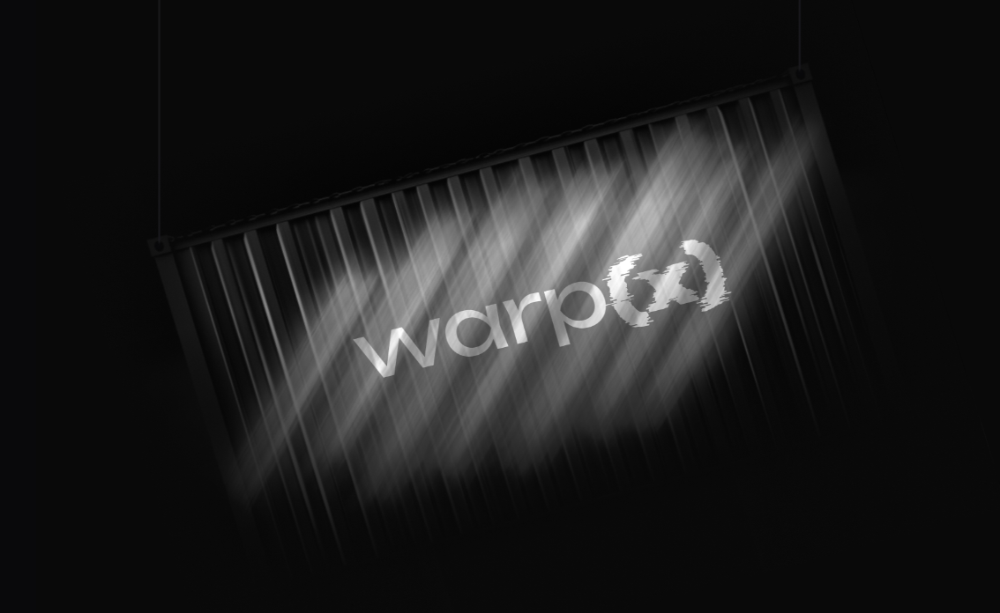
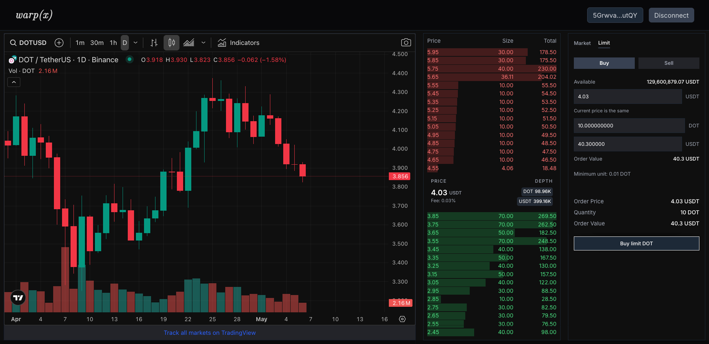
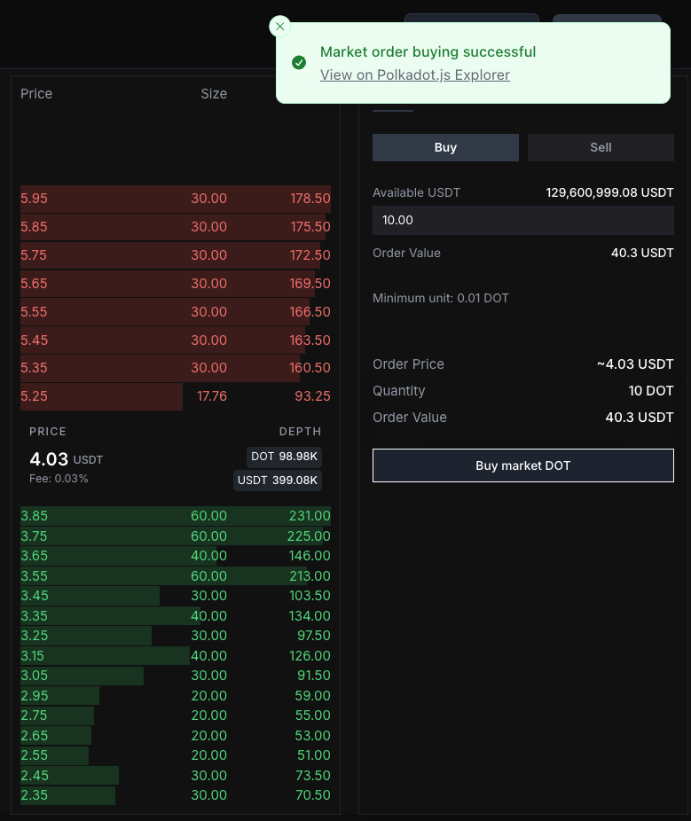
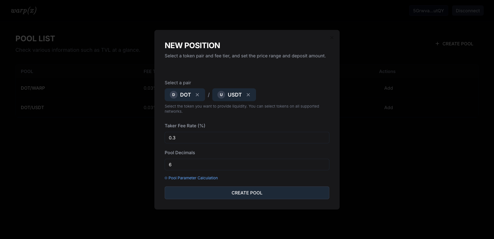
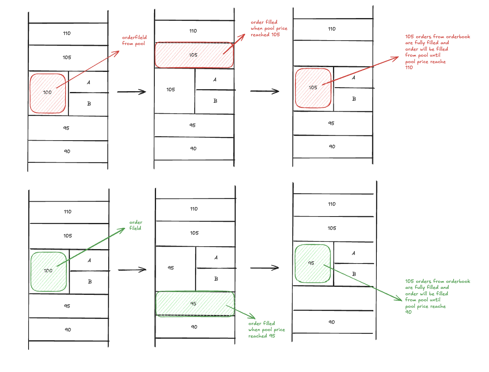
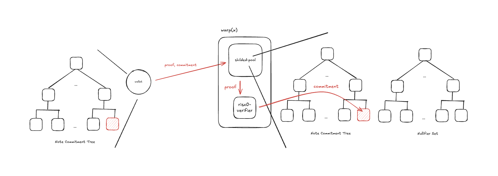
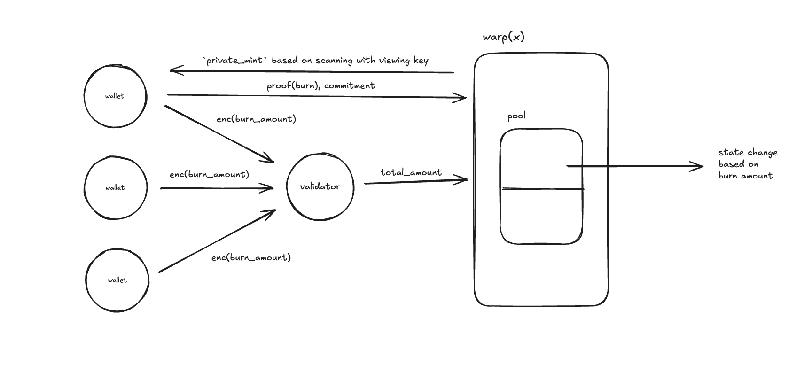

# warp(x): Privacy-preserving Hybrid Orderbook



# Overview

**_warp(x)_** is revolutionizing decentralized trading by introducing a next-generation hybrid DEX protocol that seamlessly combines the efficiency of traditional orderbooks with the flexibility of Automated Market Makers (AMM). Our platform stands at the forefront of DeFi innovation, offering a unique blend of features that address critical challenges in the current decentralized trading landscape.

At its core, _warp(x)_ implements a sophisticated hybrid trading system that merges the best aspects of **orderbook and AMM** models. This innovative approach creates an optimized trading environment that benefits both liquidity providers and traders, significantly improving market efficiency and liquidity depth.

Privacy and security are fundamental to our design philosophy. We've integrated **Zcash's shielded pool with zero-knowledge proof protocol** alongside **RISC0-verifier** technology to enable truly private transactions while maintaining full verifiability. This breakthrough in privacy-preserving trading ensures that users can trade with confidence, knowing their transaction details remain confidential.

Built on the robust _Polkadot_ framework, _warp(x)_ leverages the platform's proven **security** infrastructure and cross-chain **interoperability** capabilities. This foundation allows us to create a scalable, multi-chain architecture that can seamlessly interact with various blockchain ecosystems.

To ensure optimal performance and scalability, we're planning to implement **NOMT (Nearly Optimal Merkle Trie)**, a cutting-edge storage solution that dramatically improves I/O operations. This technology enables fast random access and efficient Merkle tree updates, making _warp(x)_ capable of handling high-volume trading while maintaining exceptional performance.

_warp(x)_ represents a significant leap forward in decentralized trading technology, combining privacy, efficiency, and scalability in a single, powerful platform. Our solution addresses the growing need for private, efficient, and scalable trading solutions in the rapidly evolving DeFi landscape.

# Team Members

- **Raf** [Github](https://github.com/cocoyoon) | [LinkedIn](https://www.linkedin.com/in/소윤-정-066165179/)

  - Roles: Runtime Development, Planning

- **Kiyori** [Github](https://github.com/thxforall)
  - Roles: Frontend Development, Design

# Demo Video

[Youtube Link](https://www.youtube.com/watch?v=Fk9NiZLgph8)

# Application

- Orderbook
  
- Submit Extrinsic
  
- Create Pool
  

# Technical Details

### Runtime Details

#### 1. [Hybrid Orderbook](https://github.com/warpxprotocol/warpx/tree/main/pallets/hybrid-orderbook)



`hybrid-orderbook` pallet implements an innovative trading system that dynamically routes orders to the most favorable execution venue:

- **Price-Optimized Order Routing**

  - Real-time comparison between AMM pool price and orderbook best prices
  - Dynamic order routing to the venue offering the best execution price
  - Seamless switching between AMM and orderbook based on price advantage
  - Continuous price discovery through competitive execution venues

- **Hybrid Matching System**

  - **AMM Advantages**

    - Zero spread trading
    - Continuous liquidity provision
    - Automated price discovery
    - Lower slippage for small trades

  - **Orderbook Advantages**
    - Price-time priority execution
    - Market maker incentives
    - Better price discovery for large trades
    - Transparent order depth
    - Customizable order types (limit, market, stop-loss)

- **Efficient Swap Calculation**
  - Binary search algorithm (O(log n)) for optimal swap amount calculation
  - Maximum swap amount optimization
  - Slippage protection through price impact calculation

#### 2. [Private Transaction System](https://github.com/warpxprotocol/warpx/tree/feat/shielded-pool)

_Private Transaction System is under development on branch [`feat/shielded-pool`](https://github.com/warpxprotocol/warpx/tree/feat/shielded-pool). We're facing the same [issue](https://github.com/risc0/risc0/issues/2514) with risc-0 and Substrate integration. Planning to fix this after the hackathon. That is why we decided to create demo of [`private-tx-demo`](./private-tx-demo/private-tx/)_ separately.

_warp(x)_ will implement a sophisticated privacy-preserving architecture that focuses on protecting trader identities while maintaining transparent market operations:

##### State Management Architecture

- **Private State**

  - Trader's identity and trading history stored locally
  - Only commitment values stored on-chain
  - Full trader privacy maintained off-chain

- **Public State**
  - Note commitment tree for tracking asset states
  - Nullifier set for double-spend prevention
  - Transparent market operations and prices
  - Public order book visibility

##### Note-Based Asset Management



- Each asset state represented as a cryptographic note
- Merkle tree structure for efficient note commitment management
- Nullifier set for spent note tracking
- Efficient proof generation for note operations

##### RISC0-Based Proof System

- **Performance Optimization**

  - Hardware-accelerated proof generation through RISC0
  - Potential integration with **_Boundless_** prover network
  - Significant performance improvement over traditional ZK systems
  - Parallel proof generation capabilities

- **Verification System**
  - Permissionless on-chain verification
  - Efficient proof aggregation
  - State transition verification
  - Transaction validity checks
  - Potential integration with **zkVerify** verifier network

##### Private Swap Mechanism (Planned)



1. **Asset Transmutation Approach**

   - Users won't directly transact with each other
   - Instead, they will transmute one asset type to another
   - Trader identity remains private
   - Market operations remain transparent

2. **Swap Process**(Planned. Inspired by Penumbra)

   - **Phase 1: Private Burn**

     - Users will privately burn their input assets
     - Encrypt trader identity information
     - Generate zero-knowledge proofs of correct burning
     - Maintain trader privacy while showing market activity

   - **Phase 2: Batch Processing**

     - Validators will aggregate encrypted amounts
     - Decrypt batch totals
     - Compute effective clearing prices (including fees)
     - Commit prices to chain state
     - Market operations remain transparent

   - **Phase 3: Private Mint**
     - Users will be able to privately mint output funds
     - Prove consistency with burned inputs
     - Generate new notes for received assets
     - Maintain trader privacy throughout the process

##### KYC-Compliant Anonymous Trading

1. **Regulatory Compliance**

   - KYC verification required for regulatory compliance
   - Compliance with global financial regulations
   - Prevention of illicit activities
   - Support for institutional adoption

2. **Privacy-Preserving Trading**
   - Trader identity remains anonymous despite KYC
   - Trading activity visible for market transparency
   - Trading patterns and strategies protected
   - No on-chain link between KYC identity and trading activity

# Future Works

### Runtime

- [NOMT](https://github.com/thrumdev/nomt) Integration for better storage _io_
- [qp-trie](https://crates.io/crates/qp-trie) for orderbook optimization
- L2 for pre-confirmation for faster block tim
- TWAP

### Client

- Prover for creating zkp
- Wallet for storing local `Note`

### Application

- Chart intergration(Backend is needed)
- UX Improvement

# Reference

### Hybrid Orderbook

- [zeos](https://medium.com/@matthias.schoenebeck/zeos-hybrid-order-book-exchange-5d2977619188)

### Private Transaction

- [penumbra](https://penumbra.zone/)
- [risc0-verifier](https://github.com/zkVerify/risc0-verifier)

# Original Repo

- [warp(x)](https://github.com/warpxprotocol/warpx)
- [warp(x)-frontend](https://github.com/warpxprotocol/warpx-frontend)

# How to start

### Boostrap

To interact with `warp(x)-frontend`, `warp(x)`node should be bootstrapped. Following script is the helper script for the process.

0. Pre-Requirements

- `venv`

```
python3 -m venv venv

pip3 install substrate-interface && pip3 install coingecko
```

- Run `warp(x)` with [zombienet](https://github.com/paritytech/zombienet)
- Run `warp(x)-frontend` with `yarn run dev`(**If error on connecting with chain, try change ws endpoint**)

1. Fund `test` account & Create Tokens & Mint

```bash
python3 test-substrate.py \
    --ws-url ${ws-rpc-address} \
    --bootstrap \
    --test-account-seed "${test-account-seed}"
```

2. Create Pool

```bash
python3 test-substrate.py \
    --ws-url ${ws-rpc-address} \
    --create-pool \
    --account-seed ${test-account-seed} \
    --base-asset 1 \
    --base-decimals 9 \
    --quote-asset 2 \
    --quote-decimals 6 \
    --taker-fee-rate 0.03 \
    --tick-size 1 \
    --lot-size 10000000 \
    --pool-decimals 2
```

3. Add Liquidity

```bash
python3 test-substrate.py \
    --ws-url ${ws-rpc-address} \
    --add-liquidity \
    --base-asset 1 \
    --quote-asset 2 \
    --dot-amount 100000 \
    --use-real-time-price
```

4. Stress Test

This will randomly do `limit-order` and `market-order` with dev accounts(e.g Alice, Bob)

```bash
python3 test-substrate.py --stress-test \
  --ws-url ${ws-rpc-address} \
  --base-asset 1 \
  --quote-asset 2 \
  --base-price 419 \
  --tick-spacing 10 \
  --amount 1000000000 \
  --tick-range 10
```

### Website

- Go to [warp(x)](https://www.warpx.trade/) and start trading

# AI Tools

- Cluade
- Cursor IDE

# Submission Requirements

- [x] **Codebase**
  - [x] GitHub repository of the full codebase
    - [x] Keep the repo public for judges to review
  - [x] Readme describing the project in detail (this is essential to evaluating your project)
    - [x] Summary, overview, images of the demo, etc.
- [x] **Video demonstration (max 3 min)**
  - [x] A short video to demonstrate the full functionality of your project
- [ ] **Presentation (Optional)**
  - [ ] Pitch deck
    - [ ] Introduce your team, why you built (motivation/problem), what you built (solution), demonstration video, and future roadmap of the project
    - [ ] This could be used later if selected as a finalist. You can update the deck before the demo day.
- [x] **Live website of the project for the public to test/demo(Optional)**
- [x] **AI tools you have used**
- [x] **Reference**
