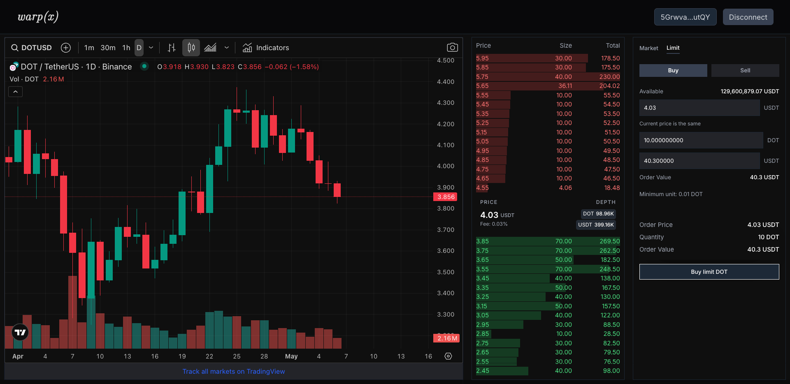
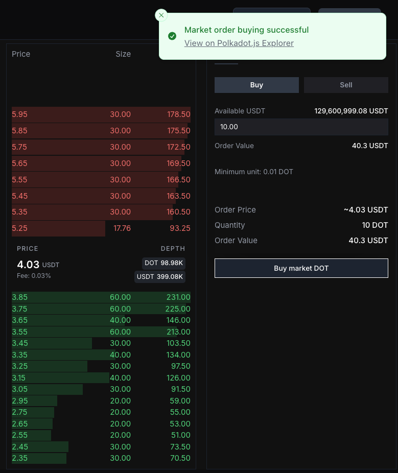

# 🌌 warp(x) Frontend

## ✨ Introduction

This is the **frontend repository** for the [warp(x)](https://warpx.vercel.app) project — a fully on-chain hybrid DEX combining both AMM and Orderbook mechanics, built on **Polkadot SDK**.

The frontend is developed using **Next.js**, **React**, **Tailwind CSS**, and **@polkadot/api**, and interacts directly with a Substrate-based node via WebSocket for live trading and asset state updates.

warp(x) enables users to:
- Trade using **Limit / Market orders**
- Interact with **AMM pools**
- Connect via **Polkadot.js Wallet Extension**
- Visualize live **orderbook and liquidity data**
- Execute **fully on-chain transactions** with real-time feedback

---

## 🚀 How to Run

Make sure the local Substrate node is running before launching the frontend.


### 🧩 SDK & Type Generation

Type generation is needed for proper API interaction with the custom runtime.

1. Move to SDK workspace:

```bash
cd packages/sdk
```

2. Run the node and expose metadata:

```bash
./target/release/warpx-node \
  --rpc-port 9988 \
  ...
```

3. Export runtime metadata:

```bash
curl -H "Content-Type: application/json" \
     -d '{"id":"1", "jsonrpc":"2.0", "method": "state_getMetadata", "params":[]}' \
     http://localhost:9988 > ./warpx.json
```

4. Generate type definitions:

```bash
# From project root
yarn codegen

# Or from SDK workspace
yarn workspace @warpx/sdk codegen
```

This will generate the required custom types for the frontend to work with the Polkadot API.

---

## 📦 Tech Stack

| Layer              | Tech                                                       |
|--------------------|------------------------------------------------------------|
| **Framework**      | [Next.js](https://nextjs.org/) (App Router)               |
| **Styling**        | [Tailwind CSS](https://tailwindcss.com/), [shadcn/ui](https://ui.shadcn.com/) |
| **Blockchain API** | [`warp/api`](./packages/sdk), [`@polkadot/api`](https://polkadot.js.org/docs/api/) |
| **Wallet Integration** | [@polkadot/extension-dapp](https://polkadot.js.org/docs/extension/) |
| **State / Data**   | React Query, Zustand                                       |
| **Build Tool**     | Turborepo (Yarn Workspaces)

---

## 📸 Screenshots





---

## 🧠 Developer Notes

- Ensure your local chain exposes the correct RPC port (9988) for SDK operations.
- Onchain logic for order matching is handled by Substrate custom pallets (see backend repo).
- Frontend provides live WebSocket updates for trades and liquidity events.
- Wallet must be connected and authorized via Polkadot.js Extension to sign transactions.

---

## 🙌 Contributors
- **Frontend**: [Kiyori (GitHub: @thxforall)](https://github.com/thxforall)
  
---
